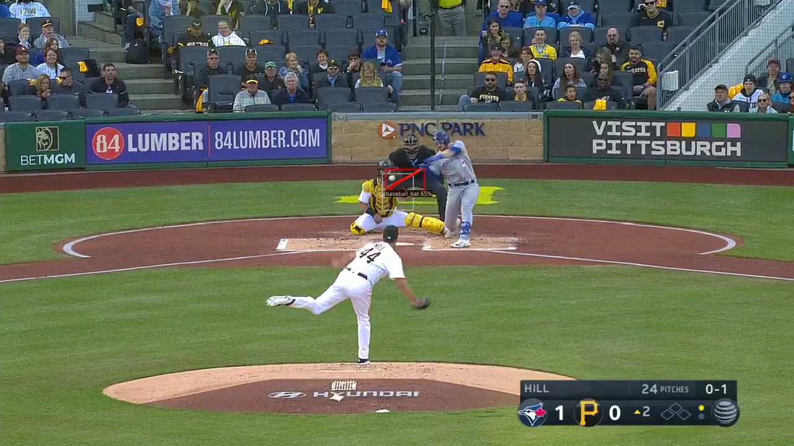

# Automatic baseball bat angle detection in broadcast videos
>  Developed by Lingran Zhao and Ziyou Ren

<p align="center">  </p>

Our code is built on the [Detic model](https://github.com/facebookresearch/Detic?tab=readme-ov-file). The implementation of bat orientation estimation can be divided into three steps:

1. Detect the baseball bat on every single frame within the interested time-clip of the video using the Detic model
2. Locate the keyframe using the detection results on the baseball bat
3. Estimate the angle from the located segmentation mask

## Installation
See [installation instructions](INSTALL.md).

## Video dataset set up

An example video dataset would looks like this:

``````
Detic/
└── videos-pirates
    └── videos_09-23
        ├── 00F01C88-4AF3-4679-A7FC-0F41E060C061.mp4
        ├── 01F8CA5C-16A9-4959-A8D3-E849F7244077.mp4
        ├── 02853FB8-DCBA-4260-A237-ECA3C3C7C040.mp4
        ......
``````

## Evaluation

Then, we can run our code with the command `python evaluate.py --vid_source_root ./videos-pirates/vid_09-23 --dist_thresh 120`. By default, the prediction results will be saved to `result_pred.csv`.

You can also save intermediate detection results for multiple runs by adding the `--det_result_root` argument.

## Demo
Run our demo using Colab (no GPU needed): [](https://colab.research.google.com/drive/183n8QE4UQEuu4MqqN7WYVU_Y22M4YEjL?usp=sharing)

The visualization of estimated bat angle :

<p align="center">  </p>